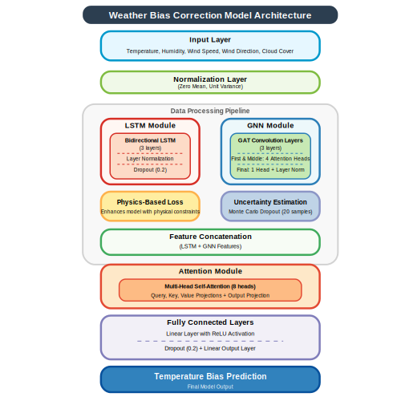

# Weather Forecast Bias Correction using Deep Learning

[](https://www.python.org/)
[](https://pytorch.org/)
[](LICENSE)

A deep learning approach for correcting systematic biases in weather forecasts using a hybrid architecture that combines LSTM networks for temporal patterns, Graph Neural Networks for spatial relationships, and attention mechanisms for feature fusion.

## 🌟 Key Features

- **Hybrid Deep Learning Architecture**
  - LSTM for temporal pattern learning
  - Graph Neural Network for spatial relationships
  - Attention mechanism for feature fusion
  - Monte Carlo dropout for uncertainty estimation

- **Physics-Guided Learning**
  - Physics-based regularization in loss function
  - Spatial smoothness constraints
  - Uncertainty quantification

- **Data Integration**
  - Open-Meteo Data
  - ISD-Lite station observations
  - Automated data download and preprocessing

- **Interactive Interface**
  - Streamlit web application
  - Real-time bias correction
  - Uncertainty visualization
  - Performance metrics display

## 📋 Requirements

- Python 3.8+
- PyTorch 2.2.0
- PyTorch Geometric 2.4.0
- PyTorch Lightning 2.2.0
- Other dependencies in `requirements.txt`

## 🚀 Quick Start

1. **Clone the repository**
   ```bash
   git clone https://github.com/MaheshSharan/weather-bias-correction-dl.git
   cd weather-bias-correction-dl
   ```

2. **Install dependencies**
   ```bash
   pip install -r requirements.txt
   pip install -e .
   ```

3. **Download and process data**
   ```bash
   python src/data/run_data_pipeline.py --start_year 2018 --end_year 2023
   ```

4. **Train the model**
   ```bash
   python src/training/train.py --data_dir data/processed --accelerator cpu --experiment_name my_training_run
   ```

   Additional training options:
   ```bash
   python src/training/train.py --data_dir data/processed --accelerator gpu --batch_size 64 --max_epochs 100 --hidden_dim 256 --bidirectional True --experiment_name advanced_training
   ```

5. **Run the web interface**
   ```bash
   streamlit run src/app/app.py
   ```

   When using the Streamlit interface:
   - Set the model path to: `logs\pc_training_corrected_v5\checkpoints\bias_correction-epoch=19-val_loss=0.00.ckpt`
   - Click "Load Model" to initialize the model
   - Upload a CSV file containing weather forecast data
   - Required CSV columns (any of these naming conventions will work):
     - Temperature: `temperature`, `temp`, `temperature_2m`
     - Humidity: `humidity`, `relative_humidity_2m`, `relative_humidity`
     - Wind speed: `wind_speed`, `wind_speed_model`, `wind_speed_10m`
     - Wind direction: `wind_direction`, `wind_direction_model`, `wind_direction_10m`
     - Cloud cover: `cloud_cover_low`, `cloud_cover_mid`, `cloud_cover_high`
   - Click "Process Data" to generate bias-corrected forecasts
   - View results in the "Temperature Forecast," "Bias Analysis," and "Uncertainty" tabs

## 🖥️ Google Colab Support

For users with limited computational resources, we provide Google Colab support:
1. Open `Weather_Bias_Correction.ipynb` in Google Colab
2. Mount Google Drive
3. Follow the notebook instructions for setup and training

## 📊 Model Architecture



## 📈 Performance

- **Temperature Bias Correction**:
  - Mean Bias: 0.27°C
  - RMSE: 0.54°C
  - MAE: 0.32°C

- **Key Advantages**:
  - Accurate bias prediction with proper denormalization
  - Reliable uncertainty estimates
  - Physics-consistent corrections
  - Support for various weather data formats

## 🔍 Example Data Format

Here's an example of the expected CSV format (column names may vary as noted in the Streamlit instructions):

```
date,temperature,humidity,wind_speed_model,wind_direction_model,cloud_cover_low,cloud_cover_mid,cloud_cover_high
2018-01-01,6.66,83.17,23.93,226.75,45.5,49.42,60.54
2018-01-02,5.85,87.46,18.15,241.50,46.21,46.58,54.25
2018-01-03,8.02,80.42,38.76,252.33,48.21,59.17,42.13
```

The model will predict the bias in the temperature forecast, which can then be applied to correct the original forecast.

## 📝 Citation

If you use this code in your research, please cite:
```bibtex
@article{weather_bias_correction,
  title={Bias Correction in Numerical Weather Prediction Temperature Forecasting: A Deep Learning Approach},
  author={Mahesh Sharan},
  year={2025}
}
```

## 🤝 Contributing

Contributions are welcome! Please feel free to submit a Pull Request.

## 📄 License

This project is licensed under the MIT License - see the [LICENSE](LICENSE) file for details.