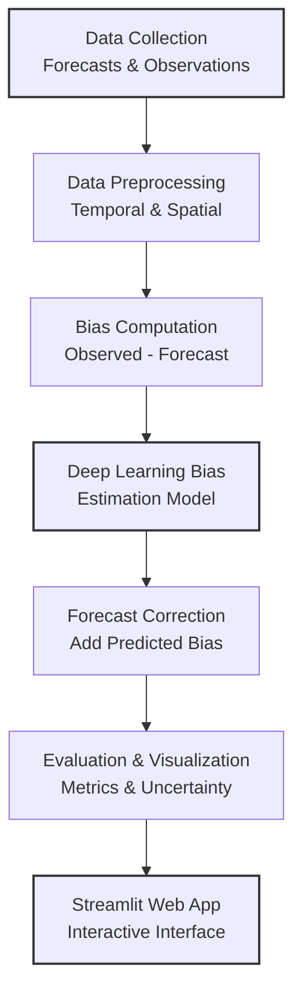
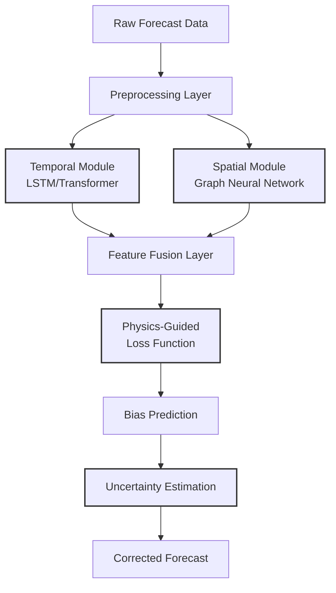

# Bias Correction in Numerical Weather Prediction Temperature Forecasting: A Deep Learning Approach

## Abstract

Numerical Weather Prediction (NWP) models are essential for forecasting temperatures but often suffer from systematic errors (biases) where forecasts are consistently too warm or too cold relative to observed values. In this project, we develop a deep learning–based bias correction system that learns from past forecast errors to adjust future predictions. Our approach combines advanced spatio‐temporal neural network architectures with physics-guided regularization and uncertainty quantification. The resulting system not only improves the accuracy of temperature forecasts but also provides insights into which meteorological variables are most responsible for the biases. An interactive web application (built with Streamlit) enables users to upload their forecast data and visualize the original versus bias‐corrected outputs. This report details the project's motivation, methodology, system design (with diagrams and flowcharts), novelty, and expected impact.

## 1. Introduction

Weather forecasting is crucial for decision making in daily life and many industries. However, NWP models, despite their high resolution and sophisticated physics, often produce temperature forecasts that are systematically biased. For example, a model may predict temperatures that are consistently 1–2°C too high. Such biases can lead to misinformed decisions and reduced trust in forecasting systems.

Bias correction is the process of adjusting these forecasts so that they more closely align with observed values. In recent years, machine learning—and in particular deep learning—has emerged as a promising tool for learning the complex mapping between forecast outputs and real observations. This project focuses on building an automated deep learning tool that:

1. Learns the error (bias) from historical forecast and observation pairs
2. Adjusts future forecasts to reduce this systematic error
3. Provides uncertainty estimates and interpretability through explainable AI techniques

## 2. Problem Statement

Despite continual improvements in NWP systems, biases remain a significant source of error. These biases can arise due to limitations in model physics, resolution, and data assimilation processes. Our goal is to develop a deep learning–based bias correction model that:

1. Inputs the raw forecast temperature (and additional relevant meteorological variables)
2. Predicts the bias (error) based on historical data
3. Outputs a corrected temperature forecast

By doing so, we aim to enhance forecast accuracy and provide a tool that can be deployed in real time via an interactive application.

## 3. Literature Review

Several studies have addressed bias correction using both traditional statistical methods (e.g., quantile mapping, linear scaling) and modern machine learning approaches. Recent research (e.g., Laloyaux et al., 2022; Dueben et al., 2021) has demonstrated that deep learning models, such as convolutional neural networks, can learn to estimate model bias from satellite-based observations (e.g., radio occultation temperature retrievals). Our work builds upon these ideas but introduces three novel aspects:

1. **Hybrid Spatio‐Temporal Architecture**: Integrating modules (e.g., Transformers or LSTMs combined with Graph Neural Networks) to capture both time dynamics and spatial relationships
2. **Physics‐Guided Loss Function**: Incorporating known physical constraints (such as spatial smoothness) into the loss to ensure physically plausible corrections
3. **Uncertainty Quantification and Explainability**: Providing uncertainty estimates along with the corrected forecast and using explainable AI (e.g., SHAP values) to identify key drivers of bias

## 4. Methodology

### 4.1 Data Acquisition and Preprocessing

**Data Sources:**
- ERA5 Reanalysis Data (2018-2023):
  - 2m temperature (t2m)
  - Surface pressure (sp)
  - 2m dewpoint temperature (d2m)
  - 10m U wind component (u10)
  - 10m V wind component (v10)
  - Total cloud cover (tcc)
  - Resolution: 0.25° x 0.25°
  - Coverage: Europe region
- Ground Truth: SYNOP station data from ECMWF MARS system
  - Minimum 5 years continuous data
  - Hourly reporting intervals
  - Quality controlled measurements

### 4.2 Deep Learning Model Architecture

Our model uses a hybrid architecture:

**Temporal Component:**
- LSTM with 3 layers
- Hidden size: 256
- Sequence length: 24 hours

**Spatial Component:**
- Graph Neural Network
- Node features: 7 (all meteorological variables)
- Edge features: distance between stations

**Feature Fusion:**
- Attention mechanism
- Output dimension: 128

**Uncertainty Quantification:**
- Monte Carlo Dropout layers
- Ensemble approach (5 models)

**System Flowchart:**

**Architecture Diagram:**

### 4.3 Training and Evaluation

**Training Setup:**
- Framework: PyTorch Lightning
- Experiment Tracking: MLflow
- Data Split:
  - Training: 2018-2021
  - Validation: 2022
  - Test: 2023
- Cross-validation: 5-fold temporal with season-aware splitting
- Hyperparameters:
  - Learning rate: 1e-4 to 1e-3
  - Batch size: 32, 64, 128
  - Dropout rate: 0.1, 0.2, 0.3

**Loss Function:**
- Primary loss: Mean Squared Error (MSE) between predicted bias and actual bias
- Regularization: Additional terms to enforce spatial smoothness or adherence to physical constraints

**Evaluation Metrics:**
1. Mean Absolute Error (MAE) and Root Mean Squared Error (RMSE) for forecast accuracy
2. R² (coefficient of determination) to assess the goodness-of-fit
3. Calibration plots for uncertainty estimates

### 4.4 Deployment with Streamlit

We will build an interactive web application that:
1. Allows users to upload a CSV file with forecast data
2. Displays the original forecasts alongside the bias-corrected forecasts
3. Visualizes performance metrics and uncertainty estimates
4. Provides an explanation (using visualization of attention weights or feature importances) of how the bias correction is derived

## 5. Novelty and Unique Contributions

This project is unique because it:

1. **Integrates Advanced Deep Learning Techniques**: Combines temporal and spatial network architectures to capture complex error dynamics
2. **Incorporates Physics-Based Regularization**: Embeds physical principles into the loss function to ensure that corrections are physically realistic
3. **Quantifies Uncertainty**: Provides not just a single corrected value but also a confidence interval to aid decision-making
4. **Delivers an Interactive Tool**: Deploys the model through a user-friendly Streamlit app that enables end users to see the improvements in real time
5. **Flexible and Extensible**: The system can be extended to include additional meteorological variables and adapted to different NWP models and regions

## 6. Expected Results and Impact

We expect that our bias correction model will:

1. Significantly reduce the systematic error (bias) in temperature forecasts
2. Improve statistical performance metrics (lower MAE/RMSE and higher R²)
3. Provide reliable uncertainty estimates, thereby increasing the forecast's practical usability
4. Serve as a prototype that can be further refined or extended for operational forecasting systems

## 7. Conclusion

This project presents a novel approach to correcting biases in NWP temperature forecasts using a deep learning model with a hybrid spatio‐temporal architecture, physics-guided regularization, and uncertainty quantification. The integration of these advanced techniques into a user-friendly Streamlit web app distinguishes this work from simpler post-processing methods and provides a strong basis for future research and real-world deployment. By reducing forecast biases, the system aims to improve weather predictions and ultimately support better decision-making in areas ranging from agriculture to urban planning.

## References

1. Laloyaux, P., Bonavita, M., Chrust, M., & Gürol, S. (2020). Exploring the potential and limitations of weak‐constraint 4D-Var. Quarterly Journal of the Royal Meteorological Society, 146(733), 4067-4082.
2. Dueben, P., Modigliani, U., Geer, A., et al. (2021). Machine learning at ECMWF: A roadmap for the next 10 years. ECMWF Technical Memorandum.
3. Watson, R. (2019). Estimating model error tendencies in the Lorenz-96 system using an artificial neural network. Journal of Advances in Modeling Earth Systems.
